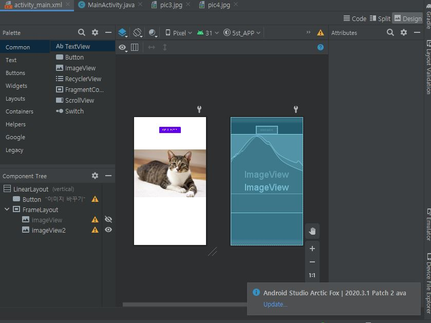
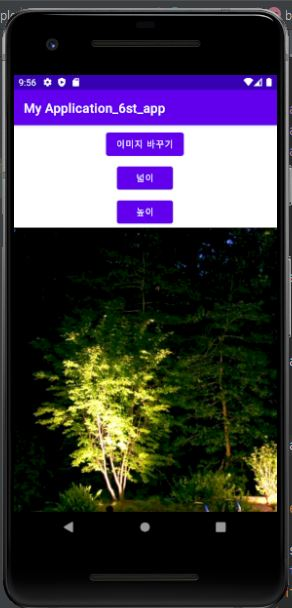

# 20273006_njs-androidApp1

## 4주차 과제
앱 이름 : < 뷰티데이즈 >
네일/피티/요가/필라테스 등의 계열은 예약을 할 때 가격이 공개되지 않아 따로 시간을 내 sns로 문의를 줘야 하는 곳들이 많음, 네이버예약도 식당 위주 -> 시간 오래 걸림 , 말걸기 어렵고 불편함을 느끼는 사람 많음.
솔직한 리뷰란과 가격 공개로 선택에 도움을 주고 빠른 예약 가능
+a 로 주문제작 아이템 카테고리도 추가! ex) 케이크, 핸드폰 케이스 등 ->위와 같은 불편함 

## 5주차 과제
교수님 아직 오류 관련 큐엔에이 답변을 못 받아서 실행 직전까지 한 작업 캡쳐본 업로드 합니다ㅠㅠ 감사합니다.
</img>

## 6주차 과제
</img>
</img>
</img>
